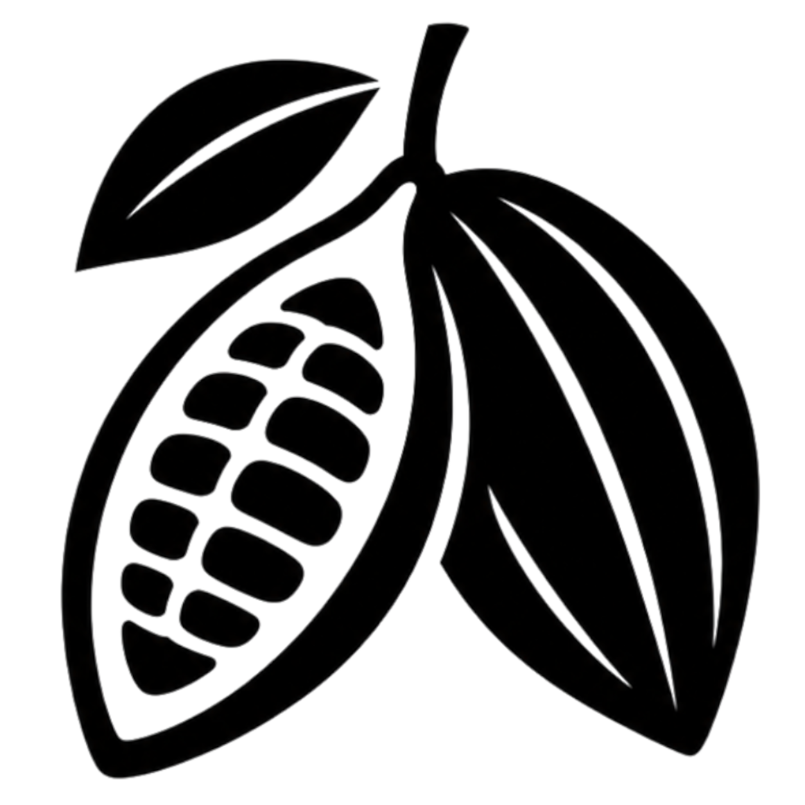

<div align="center">
  
  <h1>Cacao Performance</h1>
  <p><strong>System Performance Monitor & Customizable Desktop Floating Widget Studio</strong></p>

  <p>
    <a href="#features">Features</a> •
    <a href="#installation">Installation</a> •
    <a href="#build--release">Build & Release</a> •
    <a href="#tech-stack">Tech Stack</a> •
    <a href="#license">License</a>
  </p>
</div>

---

## 🚀 English Overview

**Cacao Performance** is a high-performance, lightweight desktop telemetry monitor and floating widget studio built with **Tauri 2**, **Rust**, and **Svelte 5**.

Designed with a rich chocolate-toned UI design system, it delivers real-time system metrics (CPU, GPU, RAM, Disk, Temperature sensors, Process Manager) and allows users to craft and launch fully customizable desktop floating widgets with custom background images, fonts, position anchors, and transparency.

### ✨ Key Features
- 📊 **Real-time Hardware Telemetry**: Monitors CPU usage/temperature, GPU usage/sensor fallback, RAM allocation, and Disk storage.
- ⚡ **Process Manager**: Real-time process listing with search filtering and instant process termination (`kill process`).
- 🎨 **Desktop Widget Studio**: Custom floating desktop widgets with 8+ Google Fonts, custom image backgrounds, position controls (9 anchors), opacity, and color palette customization.
- 🌐 **Multi-language Support**: i18n support for Spanish (🇪🇸), English (🇺🇸), Italian (🇮🇹), Japanese (🇯🇵), and Chinese (🇨🇳).
- 🎨 **Frameless Custom Titlebar**: Complete window dragging, minimize, maximize, close IPC handlers, dark mode logo auto-inversion, and responsive mobile-drawer menu for compact window sizes.
- 🔄 **In-App Update Checker**: Quick-action titlebar button to check for new app versions and releases.

---

## 🇪🇸 Descripción en Español

**Cacao Performance** es un monitor de rendimiento de sistema ligero y creador de widgets flotantes de escritorio construido con **Tauri 2**, **Rust** y **Svelte 5**.

Cuenta con un sistema de diseño con tonos chocolate, métricas de hardware en tiempo real (CPU, GPU, RAM, Disco, temperaturas, Administrador de Procesos) y permite crear widgets flotantes totalmente personalizables para el escritorio con imágenes de fondo, fuentes de Google Fonts, opacidad y anclas de posición.

---

## 🛠️ Tech Stack

- **Framework**: [Tauri v2](https://tauri.app/)
- **Backend System Telemetry**: [Rust 1.97+](https://www.rust-lang.org/) + `sysinfo` crate
- **Frontend Logic**: [Svelte 5](https://svelte.dev/) (Runes reactivity) + TypeScript
- **Bundler & Tooling**: [Vite](https://vitejs.dev/) + `pnpm`
- **Styling**: Custom Chocolate Design System CSS (No heavy framework overhead)

---

## 📦 Installation & Local Setup

### Prerequisites
- [Node.js](https://nodejs.org/) (v18+)
- [pnpm](https://pnpm.io/) (`npm install -g pnpm`)
- [Rust](https://www.rust-lang.org/tools/install) (1.80+)
- Linux dependencies (Ubuntu/Debian):
  ```bash
  sudo apt update
  sudo apt install -y libwebkit2gtk-4.1-dev build-essential curl wget file libssl-dev libgtk-3-dev libayatana-appindicator3-dev librsvg2-dev
  ```

### Development Server
1. Clone the repository:
   ```bash
   git clone https://github.com/USERNAME/cacaoperformance.git
   cd cacaoperformance
   ```
2. Install frontend dependencies:
   ```bash
   pnpm install
   ```
3. Launch Tauri application in development mode:
   ```bash
   pnpm tauri dev
   ```

---

## 🔨 Build & Release

To compile production-ready binaries:

```bash
# Build production bundle for current OS
pnpm tauri build
```

The compiled binaries will be available in:
- **Linux**: `src-tauri/target/release/bundle/deb/` (.deb) & `AppImage`
- **Windows**: `src-tauri/target/release/bundle/msi/` (.msi) & `.exe`
- **macOS**: `src-tauri/target/release/bundle/dmg/` (.dmg)

---

## 🤖 Continuous Integration & GitHub Releases

To automatically build and publish release binaries for Linux, Windows, and macOS on every tagged GitHub release, create `.github/workflows/release.yml` with **Tauri Action**:

```yaml
name: Release App
on:
  push:
    tags:
      - 'v*'

jobs:
  release:
    permissions:
      contents: write
    strategy:
      fail-fast: false
      matrix:
        platform: [ubuntu-22.04, windows-latest, macos-latest]
    runs-on: ${{ matrix.platform }}
    steps:
      - uses: actions/checkout@v4
      - uses: pnpm/action-setup@v3
        with:
          version: 9
      - uses: actions/setup-node@v4
        with:
          node-version: 22
          cache: 'pnpm'
      - uses: dtolnay/rust-toolchain@stable
      - name: Install dependencies (Ubuntu)
        if: matrix.platform == 'ubuntu-22.04'
        run: |
          sudo apt-get update
          sudo apt-get install -y libwebkit2gtk-4.1-dev libappindicator3-dev librsvg2-dev patchelf
      - name: Build App
        uses: tauri-apps/tauri-action@v0.5
        env:
          GITHUB_TOKEN: ${{ secrets.GITHUB_TOKEN }}
        with:
          tagName: v__VERSION__
          releaseName: 'Cacao Performance v__VERSION__'
          releaseBody: 'See release notes for full details.'
          releaseDraft: false
          prerelease: false
```

---

## 📜 License

Distributed under the **MIT License**. Free to use, modify, and distribute.

Developed with 🤎 for Linux, Windows & macOS.
